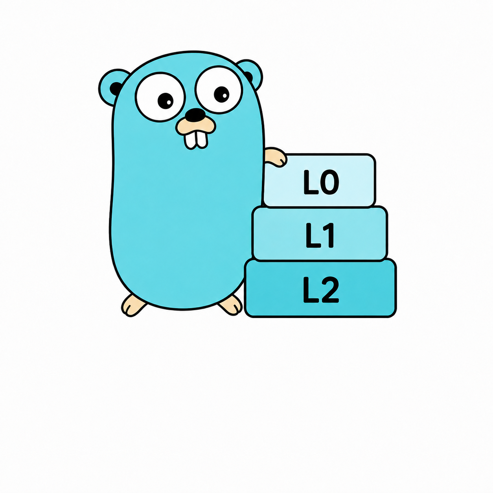

<p align="center">
  
</p>

# SamKv
<p align="center">
  
  
  
</p>

面向结构化日志场景的单机 LSM-Tree KV 存储引擎。

## 目录
- [快速开始](#快速开始)
- [HTTP API](#http-api)
- [WebUI](#webui)
- [命令行工具](#命令行工具)
- [Go API](#go-api)
- [代码文档与示例](#代码文档与示例)
- [QueryFormat](#queryformat)
- [配置](#配置)
- [存储与恢复](#存储与恢复)
- [测试与压测](#测试与压测)

## 快速开始

环境要求：Go 1.25.1 或兼容版本。

```bash
go install github.com/23jdd/SamKv
Samkv 
SamKv -f new.env   # 指定 env 文件
SamKv start     # 以Daemon 方式运行
SamKv start -f new.env  # 指定 env 文件
SamKv stop # 停止 Daemon 
SamKv status #  检查 Daemon 状态
```

默认示例配置监听 `0.0.0.0:9999`，数据写入 `./logs`。服务收到 `SIGINT` 或 `SIGTERM` 后会优雅关闭 HTTP Server 和 Store。


同一个数据目录只能由一个 Store 进程打开。第二个进程会收到 `store: data directory is locked`，`LOCK` 文件中保留锁持有者信息。

## HTTP API

### 普通 KV

| 方法 | 路径 | 请求体 | 成功响应 |
| --- | --- | --- | --- |
| `GET` | `/healthz` | 无 | `200 {"status":"ok"}` |
| `PUT` | `/kv/*key` | `{"value":"..."}` | `204 No Content` |
| `GET` | `/kv/*key` | 无 | `200 {"key":"...","value":"..."}` |
| `DELETE` | `/kv/*key` | 无 | `204 No Content` |
| `GET` | `/scan?start=&end=` | 无 | `200 {"records":[{"key":"...","value":"..."}]}` |

`*key` 可以包含 `/`。缺少 key 返回 `400`，key 不存在返回 `404`，SSTable 读取损坏等错误返回 `500`，健康检查在 Store 异常时返回 `503`。HTTP 请求体和编码后的 WAL 单条记录上限均为 64 MiB。HTTP 路由内置 CORS middleware，普通响应和 `OPTIONS` 预检请求都会返回跨域头，默认允许 `GET,POST,PUT,DELETE,OPTIONS` 和 `Content-Type,Authorization` 请求头。

```bash
curl -X PUT http://127.0.0.1:9999/kv/app/config \
  -H "Content-Type: application/json" \
  -d '{"value":"enabled"}'

curl http://127.0.0.1:9999/kv/app/config
curl -X DELETE http://127.0.0.1:9999/kv/app/config

curl "http://127.0.0.1:9999/scan?start=app/a&end=app/z"
curl "http://127.0.0.1:9999/scan?start=app/"
curl "http://127.0.0.1:9999/scan?end=app/z"
curl "http://127.0.0.1:9999/scan"
```

### 结构化日志写入

```bash
curl -X POST http://127.0.0.1:9999/logs \
  -H "Content-Type: application/json" \
  -d '{
    "timestamp":"2026-07-24T10:30:00Z",
    "labels":{"app":"nginx","level":"ERROR","host":"server1"},
    "message":"upstream connection failed"
  }'
```

成功返回 `201` 和自动分配的唯一序列号：

```json
{"sequence":1}
```

`timestamp` 可省略，服务会使用当前 UTC 时间。`sequence` 可省略或设为 `0`，由 Store 自动分配。批量写入最多接受 10,000 条：

```bash
curl -X POST http://127.0.0.1:9999/logs/batch \
  -H "Content-Type: application/json" \
  -d '{
    "entries":[
      {"labels":{"app":"api"},"message":"request started"},
      {"labels":{"app":"api","level":"ERROR"},"message":"request failed"}
    ]
  }'
```

### 结构化日志查询

`query` 参数使用 [QueryFormat](#queryformat)。matcher 会对日志 `message` 执行区分大小写的 Unicode 码点匹配，服务在 matcher 两侧补 `%` 实现“内容包含”语义，标签执行等值子集匹配：

```bash
curl -G http://127.0.0.1:9999/logs/query \
  --data-urlencode 'query="upstream connection failed"{app=nginx,level=ERROR}[1h]' \
  --data-urlencode 'limit=100'
```

响应包含实际时间窗口、matcher、结果和是否被截断：

```json
{
  "matcher":"upstream connection failed",
  "start":"2026-07-24T09:30:00Z",
  "end":"2026-07-24T10:30:00Z",
  "entries":[
    {
      "timestamp":"2026-07-24T10:30:00Z",
      "labels":{"app":"nginx","level":"ERROR","host":"server1"},
      "message":"upstream connection failed",
      "sequence":1
    }
  ],
  "truncated":false
}
```

`limit` 默认 1,000，取值范围为 1 到 10,000。

### 指标

```bash
curl http://127.0.0.1:9999/metrics
```

`/metrics` 使用 Prometheus 文本格式，包含读写、Checkpoint、Compaction、MemTable、WAL/SSTable 字节数、每层文件数、Block Cache 命中/未命中/淘汰以及后台错误状态。`samkv_compaction_subtasks_total` 记录已启动的 key-range 子任务，`samkv_compaction_output_files_total` 记录成功发布的 Compaction 输出表。指标为进程内统计，重启后计数器重新开始。

## WebUI

`webui` 提供一个无需前端构建步骤的静态可视化控制台，默认监听 `127.0.0.1:9998`，并把 `/api/*` 代理到 SamKV HTTP API 默认地址 `http://127.0.0.1:9999`：

```bash
go run ./webui

# 自定义 WebUI 地址、端口和后端 API
go run ./webui -addr 127.0.0.1 -port 9997 -api http://127.0.0.1:9999
```

可视化功能包括：

- 健康检查和关键指标概览。
- KV 写入、读取、删除和范围扫描，结果区会展示操作摘要、数据大小、记录列表，并支持复制 key/value。
- 结构化日志单条写入、批量写入和查询。日志 label 支持类似 GitHub label 的逐项添加和删除；查询区提供 Search、Range、Offset、Limit 和 Filter Labels 构建器，并自动生成 QueryFormat。
- 指标详情会把 `/metrics` 中的关键 Prometheus 指标渲染成可读的状态条。

WebUI 进程只负责静态资源和反向代理；读写数据仍由 SamKV 主服务处理，因此需要先启动 SamKV HTTP API 服务。默认只绑定本机地址，如需暴露到其他机器，应在可信网络或反向代理后使用。

## 命令行工具

### samctl

```bash
go install ./samctl

samctl put app/config enabled
samctl get app/config
samctl del app/config
samctl health
samctl metrics
samctl scan app/a app/z
samctl scan -start app/a

samctl log -label app=api -label level=ERROR -message "request failed"
samctl log-batch -file entries.json
samctl query -limit 100 '"request failed"{app=api,level=ERROR}[1h]'
```

`log-batch` 的文件可以是 `[{"labels":{"app":"api"},"message":"..."}]`，也可以是 HTTP API 同款的 `{"entries":[...]}`。

默认连接 `localhost:9999`。也可以指定地址、端口和超时：

```bash
samctl get -a 127.0.0.1 -p 9999 -timeout 5s app/config
samctl -m put -k app/config -v enabled -a 127.0.0.1 -p 9999
samctl query -a 127.0.0.1 -p 9999 -timeout 5s 'error{app=api}[15m]'
```

### samkv-admin

维护命令要求服务已停止；目录锁会阻止管理工具和服务同时打开数据目录。

```bash
go install ./cmd/samkv-admin

samkv-admin verify -dir ./logs
samkv-admin repair -dir ./logs
samkv-admin backup -dir ./logs -dest ./backup-20260724
samkv-admin verify-backup -source ./backup-20260724
samkv-admin restore -source ./backup-20260724 -dest ./restored
samkv-admin upgrade -dir ./logs
```

- `verify` 校验全部 DataBlock、记录顺序、元数据范围和 BloomFilter。
- `repair` 以 Manifest 为权威来源，重建 Manifest，并把损坏 SSTable 移到 `corrupt/`；它无法恢复已经损坏的数据。
- `backup` 先执行 Checkpoint，再复制 Manifest、WAL 和已发布 SSTable，并在 `BACKUP.json` 保存 SHA-256。
- `restore` 只恢复到尚不存在的目录，发布前会完整校验备份。
- `upgrade` 将兼容读取的旧 SSTable 重写为当前格式。

## Go API

### 打开与持久性

```go
options := store.DefaultOptions()
options.WALSyncPolicy = store.WALSyncEveryWrite
options.WALSegmentSize = 64 * 1024 * 1024
options.CompressionType = utils.CompressionSnappy
options.CompactionRateLimitBytesPerSec = 64 * 1024 * 1024
options.Retention = 7 * 24 * time.Hour
options.MaxSizeBytes = 10 * 1024 * 1024 * 1024

db, err := store.NewStoreManagerWithOptions("./data", options)
if err != nil {
    log.Fatal(err)
}
defer db.Close()
```

WAL 有两种明确策略：

- `WALSyncInterval`：默认每 50 ms 执行一次 fsync。写入延迟较低，但操作系统或机器崩溃时可能丢失最近一个同步周期的数据。
- `WALSyncEveryWrite`：每次写操作都在返回前完成 fsync，延迟更高，但返回成功的数据已经交给文件系统同步。

两种策略在正常 `Close` 时都会刷新缓冲并同步。Checkpoint 是把内存数据发布为 SSTable 并裁剪 WAL，不是替代 WAL fsync 的提交协议。

### KV 与日志

```go
if err := db.Put("key", "value"); err != nil {
    panic(err)
}

value, found, err := db.GetWithError("key")
records, err := db.Scan("a", "z") // 半开区间 [a, z)

sequence, err := db.WriteLog(store.LogEntry{
    Timestamp: time.Now().UTC(),
    Labels: []utils.Label{
        {Name: "app", Value: "nginx"},
        {Name: "level", Value: "ERROR"},
    },
    Message: []byte("upstream connection failed"),
})

end := time.Now().UTC()
logs, err := db.Query(end.Add(-time.Hour), end, []utils.Label{
    {Name: "app", Value: "nginx"},
})

_, _, _, _, _, _ = value, found, records, sequence, logs, err
```

`Get` 为兼容旧调用保留；需要区分“不存在”和“读取损坏”时应使用 `GetWithError`。`Query` 使用闭区间 `[startTime, endTime]`，标签是子集匹配。普通 KV 的 key 不是结构化日志 key，不能用于 `Query`、基于时间的 `Retention` 或按时间淘汰的 `MaxSizeBytes`。

### 批量、Compaction 与维护

```go
batch := store.NewBatch().
    Put("a", "1").
    Put("b", "2").
    Delete("a")

if err := db.WriteBatch(batch); err != nil {
    panic(err)
}

_, err := db.Checkpoint()
result, err := db.CompactNextLevel()
result, err = db.CompactLevel(0)
result, err = db.Compact() // 显式全量合并

verification, err := db.Verify()
backup, err := db.Backup("./backup-20260724")
upgrade, err := db.UpgradeFormat()
stats := db.Stats()

_, _, _, _, _, _ = result, verification, backup, upgrade, stats, err
```

`WriteBatch` 将整批数据一次追加到 WAL，再按顺序更新 MemTable；WAL 恢复仍按单条记录重放，因此它不是支持回滚的跨记录事务。

后台 Compaction 使用层级阈值增量合并。L0 达到 `CompactionThreshold` 后合并全部 L0 及其与 L1 重叠的文件；L1 以上每次选择一个源文件和下一层重叠文件。单次分层 Compaction 根据 DataBlock 索引把 key 空间切成互不重叠的 `[start,end)` 子任务，最多使用 `CompactionWorkers` 个 goroutine；输入不足 `CompactionTaskBytes` 时自动减少任务数，避免小文件放大。各子任务并行扫描并生成独立 SSTable，所有输出成功后才一次性发布 Manifest，失败时清理未发布文件。所有输出共享 `CompactionRateLimitBytesPerSec` 令牌桶，因此限制的是聚合带宽；`0` 可关闭限速。Compaction 顺序扫描不会写入 Block Cache。

墓碑、`Retention` 和 `MaxSizeBytes` 只在最底层回收，避免旧值重新出现。`MaxSizeBytes` 对全部子任务结果统一计算，不会被每个子任务重复使用。`Compact()` 保留为显式全量整理入口；它仍是单任务全量整理。`CompactionResult.Path` 保留为首个输出路径，新增代码应使用 `Paths`、`OutputTables` 和 `Subtasks` 查看并行结果。

## 代码文档与示例

所有 Go 源文件都在文件或包入口说明了自身职责；核心 API 旁边继续说明并发、持久性、格式和失败边界。测试文件的文件注释说明该文件覆盖的行为，便于从失败测试快速定位对应模块。

查看包文档和运行可执行 Example：

```bash
go doc ./pkg/store
go doc ./pkg/wal
go doc ./pkg/utils
go test ./... -run '^Example'
```

当前 Example 覆盖以下完整流程：

| 模块 | Example |
| --- | --- |
| Store | MemTable、Batch、BloomFilter、SSTable/懒加载 Iterator、Checkpoint、分层 Compaction、结构化日志、备份恢复 |
| WAL | Record 编解码、打开/追加/读取/关闭 |
| Utils | 复合日志 Key、none/Gzip/Snappy/LZ4/Zstd 压缩 Value |
| Parse | QueryFormat 解析与时间窗口 |
| HTTP | 使用 `httptest` 完成 KV PUT/GET |
| CLI | `samctl` 的 IPv6 地址构造 |
| Pool / SkipList | 分级缓冲池复用、有序并发表的写入读取 |

Example 是测试的一部分，输出变化会让 `go test` 失败，因此它们同时承担用法文档和回归检查。边界条件仍以 API 旁的 GoDoc 为准，例如：

- `Options{}` 不是合法完整配置，应从 `DefaultOptions()` 开始修改。
- `Scan` 是 `[startKey,endKey)`；日志 `Query` 是闭区间 `[startTime,endTime]`。
- 墓碑、`Retention` 和 `MaxSizeBytes` 只在覆盖全部旧版本的最底层 Compaction 回收。
- `Backup`/`RestoreBackup` 不覆盖已有目录；`RepairDirectory` 必须离线执行并可能永久移除损坏表中的数据。
- HTTP/CLI 的单请求或单响应上限为 64 MiB；服务当前没有 TLS、认证或限流。

## QueryFormat

[`pkg/parse`](./pkg/parse) 使用 Participle 解析：

```text
matcher{label=value,...}[range] offset duration
```

示例：

```text
error{app=nginx}[5m]
"upstream connection failed"{app=nginx,level="ERROR"}[5m] offset 1h
```

- `matcher` 必填，可以是标识符、数字或带引号字符串。
- 支持中文、emoji 等任意 Unicode 字符。
- 不支持通配符转义、字符范围或嵌套字符类；不完整的 `[` 字符类视为不匹配。
- `matcher` 支持三种通配符：`%` 匹配任意长度字符串（包括空串），`_` 匹配一个字符，`[abc]` 匹配字符类中的一个字符。
- 标签只支持等值匹配，标签名不能重复；`{}` 表示不限制标签。
- `range` 必须大于 0，格式遵循 `time.ParseDuration`。
- `offset` 可选，用于把整个查询窗口向过去平移。
- HTTP 查询先使用时间和标签索引缩小候选集，再对日志内容执行 matcher 通配符过滤。

```go
query, err := parse.ParseQueryFormat(
    `"upstream connection failed"{app=nginx,level=ERROR}[5m] offset 1h`,
)
if err != nil {
    return err
}

start, end := query.TimeRange(time.Now().UTC())
```

## 配置

| `store.Options` 字段 | 默认值 | 说明 |
| --- | ---: | --- |
| `MemTableLimit` | 4 MiB | Active MemTable 近似字节阈值，`0` 表示不自动切换 |
| `AutoCheckpoint` | `true` | 达到阈值后切换 Immutable MemTable 并在后台刷盘 |
| `CompactionThreshold` | `4` | L0 文件触发合并的数量，`0` 表示关闭 L0 自动触发 |
| `CompactionWorkers` | `4` | 单次分层 Compaction 的最大并行子任务数 |
| `CompactionTaskBytes` | 8 MiB | 每增加一个并行子任务所需的近似输入量，防止小 Compaction 产生过多文件 |
| `CompactionRateLimitBytesPerSec` | 64 MiB/s | 全量与分层 Compaction 共享输出速率；`0` 表示不限制 |
| `MaxLevels` | `4` | LSM 总层数，至少为 2 |
| `LevelBaseSizeBytes` | 64 MiB | L1 向 L2 下推的容量阈值 |
| `LevelSizeMultiplier` | `10` | 相邻非零层容量倍率 |
| `Retention` | `0` | 最底层合并时的日志保留时长，`0` 表示永久保留 |
| `MaxSizeBytes` | `0` | 最底层合并后的近似数据上限，`0` 表示不限制 |
| `BlockCacheBytes` | 64 MiB | 共享 SSTable Block Cache 容量，`0` 表示禁用 |
| `CompressionType` | `snappy` | 结构化日志新 Value：`none`、`gzip`、`snappy`、`lz4` 或 `zstd` |
| `WALSyncPolicy` | `interval` | `interval` 或 `every-write` |
| `WALSyncInterval` | `50ms` | 周期同步间隔 |
| `WALSegmentSize` | 64 MiB | segment 近似字节阈值；单条 record 不跨段拆分 |
| `WALSegmentMaxRecords` | `0` | 每段记录数阈值；`0` 表示只按字节轮转 |

服务从 `.env` 和同名进程环境变量读取配置，进程环境变量优先。`Retention` 在 `.env` 中使用小时数，`WALSyncInterval` 使用 Go duration：

如需指定其他 env 文件，使用 `samkv -f ./custom.env`。

```dotenv
dir=./logs
Address=0.0.0.0
Port=9999
MemTableLimit=4194304
AutoCheckpoint=true
CompactionThreshold=4
CompactionWorkers=4
CompactionTaskBytes=8388608
CompactionRateLimitBytesPerSec=67108864
MaxLevels=4
LevelBaseSizeBytes=67108864
LevelSizeMultiplier=10
Retention=168
MaxSizeBytes=0
BlockCacheBytes=67108864
CompressionType=snappy
WALSyncPolicy=interval
WALSyncInterval=50ms
WALSegmentSize=67108864
WALSegmentMaxRecords=0
```

## 存储与恢复

### 日志 Key 与 Value

结构化日志 key：

```text
[8 bytes ordered timestamp][sorted label_name=label_value][0x00][8 bytes sequence]
```

时间戳是翻转符号位后的 big-endian `int64`，标签按名称和值排序，并对 `%`、`|`、`=` 转义。Value 不重复保存标签：

```text
[version][compression][timestamp][message length][compressed message]
```

当前支持 `none`、Gzip、Snappy、LZ4 frame 和 Zstd；Store 的结构化日志默认使用 Snappy，`utils.NewValue` 的兼容入口仍默认 Gzip。算法编号写在每条 Value 中，因此修改默认值不影响旧数据读取。原始消息和解压输出上限均为 64 MiB。

### SSTable 与 Block 校验

```text
[DataBlock 1 + CRC32C] ... [DataBlock N + CRC32C]
[MetaBlock + CRC32C]
[IndexBlock + CRC32C]
[Footer]
```

Footer 前 6 字节是 UTF-8 Magic ，后续保存格式版本及 MetaBlock/IndexBlock 位置。SSTable v2 为每个 Block 增加 CRC32C；读取损坏 Block 会返回错误。当前代码兼容只读 v1，并拒绝未知的未来版本。

打开 SSTable 时只加载 Footer、MetaBlock 和 IndexBlock。DataBlock 按查询范围读取并进入共享 LRU Block Cache；校验和启动恢复扫描绕过缓存，避免缓存掩盖磁盘损坏。`NewIterator` 可在 `[startKey,endKey)` 内按 Block 懒加载遍历并保留墓碑，遍历结束后必须检查 `Error()`。

实现已按职责拆为 `sstable_writer.go`、`sstable_reader.go`、`sstable_block.go`、`sstable_meta.go`、`sstable_index.go`、`sstable_footer.go`、`sstable_codec.go` 和 `sstable_iterator.go`；核心 `sstable.go` 只保留稳定格式常量和类型。

### Manifest、锁与崩溃恢复

数据目录的关键文件如下：

```text
CURRENT                              # 指向已提交的 Manifest 世代
MANIFEST-00000000000000000042        # SSTable 权威版本编辑
wal-00000000000000000007.log         # 按 ID 递增回放的 WAL segment
00000000000000000123.sst             # 已发布 SSTable
LOCK                                 # 单进程目录锁
```

`CURRENT` 指向的 Manifest 是已发布 SSTable 的权威目录，记录格式版本、文件名、SSTable 版本、层级、key/时间范围、记录数、下一个文件编号和最后日志序列号。保存时先写 `MANIFEST-<generation>.tmp`、fsync、原子重命名，再写并切换 `CURRENT`；只保留最近两个世代。旧固定名 `MANIFEST`/`.bak` 会在首次成功读取后迁移。未被 `CURRENT` 引用的 Manifest 或 SSTable 被视为崩溃遗留，不参与读取。

Checkpoint 顺序是：封存当前 WAL segment，写 `*.sst.tmp` 并 fsync，原子发布 SSTable，发布新 Manifest 世代并切换 `CURRENT`，最后删除已被该 SSTable 覆盖的旧 WAL segment。Manifest 发布前 WAL 始终保留；发布后即使 segment 尚未删除，重复回放也不会改变最新值。

- WAL 默认约 64 MiB 轮转，也可按 `WALSegmentMaxRecords` 轮转；record 永远不会跨 segment 拆分。
- 每条 WAL record 自带 CRC32。恢复会跳过边界完整但 checksum/内容损坏的 record，并在 `Stats` 报告跳过数。
- 只有最后一个 segment 的残缺尾部可截断；中间 segment 截断会作为结构损坏返回错误，避免越过缺口继续恢复。
- 启动会删除未发布的 `*.sst.tmp`；孤立 `.sst` 不可见，但其文件 ID 会被保留，防止后续覆盖修复线索。
- `CURRENT` 损坏或切换中断时尝试 `CURRENT.bak`；多进程同时打开由操作系统文件锁拒绝。

备份是经过 Checkpoint 的完整本地快照，不是增量备份。恢复必须写入新目录。升级只支持向当前格式前进，不提供降级。

## 测试与压测

### 正确性检查

```bash
go test ./...
go vet ./...
go test -race ./...
```

测试覆盖 WAL 大记录、segment 字节/记录数轮转、周期/每写 fsync、完整坏记录跳过、末段残缺恢复、Checkpoint 崩溃窗口、CURRENT/Manifest 世代迁移、目录锁、SSTable Block 校验与懒加载 Iterator、五种 Value 编码模式、Compaction 聚合限速、修复隔离、Block Cache、备份恢复、结构化日志 HTTP API、QueryFormat、管理 CLI 和压力工具重开校验。

### 压力工具

压力工具分别统计纯写入、Checkpoint、关闭重开、持久化数据校验和端到端耗时：

```bash
go run ./cmd/samkv-stress \
  -mode kv \
  -count 50000 \
  -concurrency 8 \
  -value-bytes 128 \
  -payload-pattern random

go run ./cmd/samkv-stress \
  -mode logs \
  -count 50000 \
  -concurrency 8 \
  -value-bytes 128 \
  -payload-pattern random

go run ./cmd/samkv-stress \
  -mode logs \
  -count 10000 \
  -concurrency 8 \
  -value-bytes 128 \
  -payload-pattern random \
  -strict
```

- `-payload-pattern repeated` 生成高度可压缩的重复内容，也是默认值。
- `-payload-pattern random` 生成固定种子的低压缩内容，每轮数据一致。
- `-strict` 使用 `WALSyncEveryWrite`，每次写入返回前执行 fsync。
- `-verify` 默认为 `true`。工具会在 Checkpoint 后关闭 Store，重新打开数据目录，再完整读取所有记录。
- `write_operations_per_second` 只计算写入阶段；`operations_per_second` 仍表示包含全部阶段的端到端速率。
- JSON 中的 `write_duration`、`checkpoint_duration`、`reopen_duration`、`verify_duration` 和 `duration` 使用纳秒。

### 测试方法

以下结果 在 Windows/amd64、Go 1.25.1、Intel Core i7-14650HX 上取得，覆盖当前默认 Snappy 压缩、分段 WAL 和 64 KiB WAL Buffer 实现：

1. 压力工具只构建一次，各场景顺序执行，避免不同场景争抢磁盘。
2. 每轮使用新的临时数据目录，执行写入、Checkpoint、关闭、重开和完整校验。
3. 每个场景运行 3 次，表格记录中位数；写吞吐范围是 3 次实测的最小值到最大值。
4. `interval` 场景使用默认 64 KiB WAL Buffer 和 50 ms 周期；Buffer 满时立即批量刷盘。
5. 轻量矩阵 30 轮、大样本矩阵 15 轮，共 45 轮，全部通过重开持久化校验。


### 压力结果

轻量矩阵用于比较并发数、数据压缩性和 WAL 策略：

| 模式 | WAL 策略 | 记录数 | 并发 | Payload | 写吞吐中位数 | 3 轮范围 | Payload 吞吐 |
| --- | --- | ---: | ---: | --- | ---: | ---: | ---: |
| KV | interval | 5,000 | 1 | random / 128 B | 369,486 ops/s | 96,623-483,363 | 45.10 MiB/s |
| KV | interval | 5,000 | 8 | random / 128 B | 417,397 ops/s | 144,526-425,159 | 50.95 MiB/s |
| KV | every-write | 1,000 | 1 | random / 128 B | 3,354 ops/s | 3,182-3,467 | 0.41 MiB/s |
| KV | every-write | 1,000 | 8 | random / 128 B | 3,319 ops/s | 3,283-3,374 | 0.41 MiB/s |
| 日志 | interval | 5,000 | 1 | random / 128 B | 274,136 ops/s | 265,175-278,657 | 33.46 MiB/s |
| 日志 | interval | 5,000 | 8 | random / 128 B | 258,147 ops/s | 254,624-277,194 | 31.51 MiB/s |
| 日志 | interval | 5,000 | 8 | repeated / 128 B | 404,760 ops/s | 386,763-408,090 | 49.41 MiB/s |
| 日志 | interval | 5,000 | 8 | random / 1,024 B | 94,641 ops/s | 92,206-96,399 | 92.42 MiB/s |
| 日志 | every-write | 1,000 | 1 | random / 128 B | 2,889 ops/s | 2,654-3,480 | 0.35 MiB/s |
| 日志 | every-write | 1,000 | 8 | random / 128 B | 3,347 ops/s | 3,181-3,447 | 0.41 MiB/s |

大样本矩阵用于验证吞吐稳定性、分阶段耗时和多 SSTable 恢复：

| 模式 | WAL 策略 | 记录数 | Payload | 写吞吐中位数 | Checkpoint | 重开 | 校验 | 总耗时 | SSTable |
| --- | --- | ---: | --- | ---: | ---: | ---: | ---: | ---: | ---: |
| KV | interval | 50,000 | random / 128 B | 455,047 ops/s | 148.4 ms | 43.0 ms | 195.4 ms | 497.6 ms | 1 |
| KV | every-write | 10,000 | random / 128 B | 3,146 ops/s | 125.2 ms | 26.5 ms | 48.5 ms | 3,440.3 ms | 1 |
| 日志 | interval | 50,000 | random / 128 B | 258,262 ops/s | 174.4 ms | 55.7 ms | 73.4 ms | 496.1 ms | 1 |
| 日志 | interval | 20,000 | random / 1,024 B | 94,285 ops/s | 163.6 ms | 66.9 ms | 98.0 ms | 544.8 ms | 2 |
| 日志 | every-write | 10,000 | random / 128 B | 2,862 ops/s | 100.6 ms | 44.7 ms | 29.6 ms | 3,703.8 ms | 1 |


### 基准结果


基准命令：

```bash
go test ./pkg/store \
  -run '^$' \
  -bench . \
  -benchmem \
  -benchtime=1s \
  -count=3
```

下表使用 3 轮中位数：

| 基准 | 中位数 | 内存分配 | 分配次数 |
| --- | ---: | ---: | ---: |
| Put / interval | 3.36 us/op | 899 B/op | 7 allocs/op |
| Put / every-write | 410.31 us/op | 898 B/op | 6 allocs/op |
| Get / MemTable | 46.61 ns/op | 0 B/op | 0 allocs/op |
| Get / cached SSTable | 16.68 us/op | 29,168 B/op | 627 allocs/op |
| Query / structured logs | 10.39 ms/op | 42,571,867 B/op | 19,031 allocs/op |


